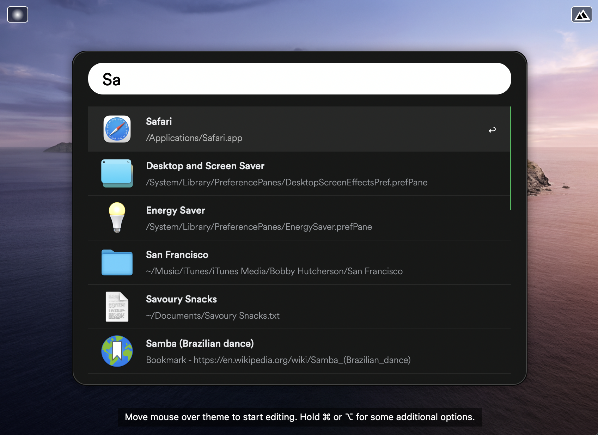
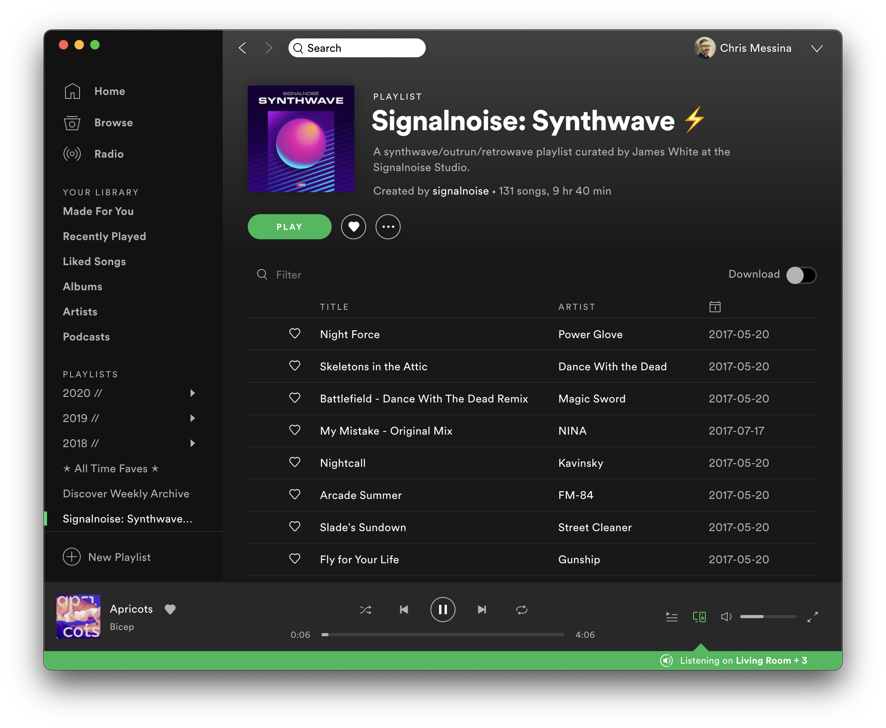

# Spotify Powerpack Theme

Here is an [Alfred Powerpack Theme](https://www.alfredapp.com/help/appearance/) that is inspired by [Spotify's](https://www.spotify.com/) appearance and color scheme.

[**Download Theme**](https://github.com/chrismessina/alfred-theme-spotify/releases/latest)

## Installation

This theme uses [Circular Air Pro](https://lineto.com/typefaces/circular) from [Lineto](https://lineto.com/). You'll need to license and install that first.

Then [download and unzip the file above](https://github.com/chrismessina/alfred-theme-spotify/releases/latest), and double-click each `.alfredappearance` file to install it.

## Preview

### Spotify

## Suggested configuration

- Disable the Alfred hat logo by checking: `Alfred Preferences › Appearance › Options › Hide hat on Alfred window`
- Disable result shortcuts by unchecking: `Alfred Preferences › Appearance › Options › Hide result shortcuts`

Simplify results by switching the result subtext to "Only for Alternative Actions".

## Inspiration

The inspiration for this theme is Spotify:

## About

This theme is unaffiliated with nor endorsed by Spotify, Inc.

<a href="https://www.alfredforum.com/topic/16380-spotify-inspired-theme/">Alfred Forum link</a>.
